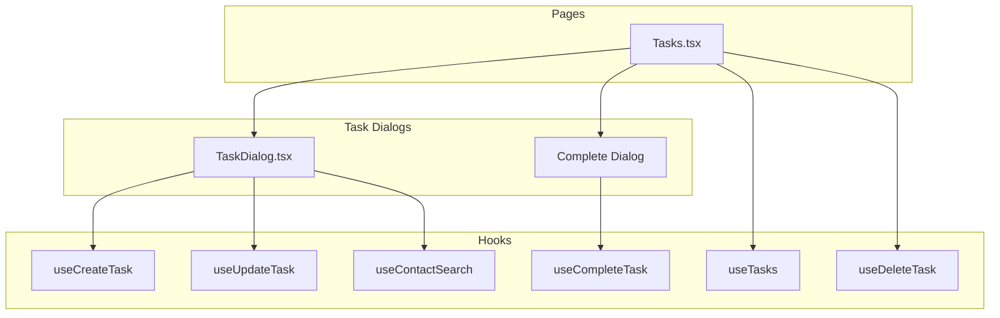

# Implement F05 Aufgabenverwaltung (Task Management)

The backend already has a solid foundation with models, schemas, services, and routes. The frontend has a basic task list page. This plan focuses on completing the missing UI components and enhancing the existing implementation per PRD requirements.

## Current State

**Backend (Complete):**

- Task model with status, priority, due_date, contact linking, follow-up support
- Full CRUD operations and complete-with-follow-up endpoint
- Contact history integration when tasks are created

**Frontend (Partial):**

- Task list with status filter and pagination
- Basic complete dialog (missing date picker for follow-up)
- Missing: Create/Edit dialogs, contact search, priority filter

---

## Implementation Plan

### 1. Add "Deferred" Status to Match PRD

The PRD specifies status "Verschoben" (Deferred), but current implementation has "Cancelled". Add the deferred status while keeping cancelled.

**Files to modify:**

- [`backend/src/models/task.py`](backend/src/models/task.py): Add `DEFERRED = "deferred"` to TaskStatus enum
- [`frontend/src/lib/types.ts`](frontend/src/lib/types.ts): Add `deferred` to TaskStatus type
- [`frontend/src/pages/Tasks.tsx`](frontend/src/pages/Tasks.tsx): Add "Verschoben" option to status dropdowns

### 2. Create TaskDialog Component for Create/Edit

Build a reusable dialog component similar to [`frontend/src/components/contacts/ContactDialog.tsx`](frontend/src/components/contacts/ContactDialog.tsx):

**New file:** `frontend/src/components/tasks/TaskDialog.tsx`

Features:

- Form fields: Title, Description, Due Date (with time), Priority, Assigned To, Contact
- Contact search with autocomplete using existing `useContactSearch` hook
- Zod validation schema
- Create and edit modes

### 3. Add Priority Filter to Tasks Page

Enhance [`frontend/src/pages/Tasks.tsx`](frontend/src/pages/Tasks.tsx):

- Add priority dropdown filter alongside status filter
- Update `useTasks` query params

### 4. Enhance Complete Task Dialog

Update the completion flow in [`frontend/src/pages/Tasks.tsx`](frontend/src/pages/Tasks.tsx):

- Add completion notes textarea
- Add date/time picker for follow-up due date
- Add priority selector for follow-up task

### 5. Wire Up Create/Edit Actions

Connect the TaskDialog to the Tasks page:

- "Neue Aufgabe" button opens TaskDialog in create mode
- Add edit button/action to task list items
- Add delete confirmation

---

## Component Architecture

---

## Key Files Summary

| Action | File |

|--------|------|

| Modify | `backend/src/models/task.py` - Add DEFERRED status |

| Modify | `frontend/src/lib/types.ts` - Add deferred to TaskStatus |

| Create | `frontend/src/components/tasks/TaskDialog.tsx` - New dialog |

| Modify | `frontend/src/pages/Tasks.tsx` - Add filters, wire dialogs |