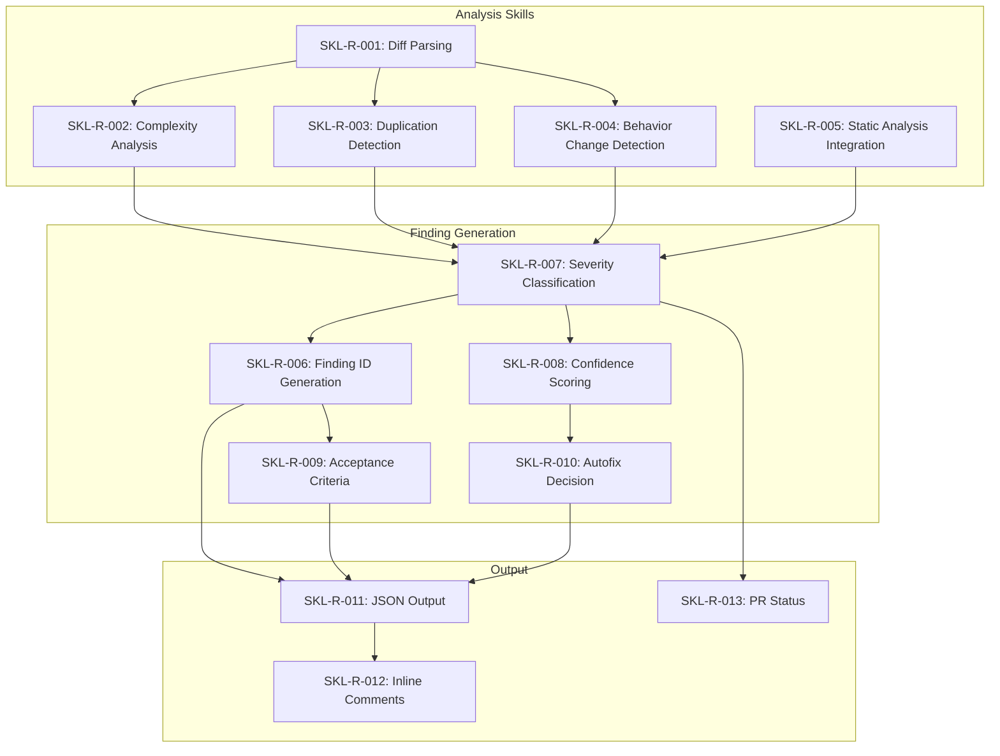
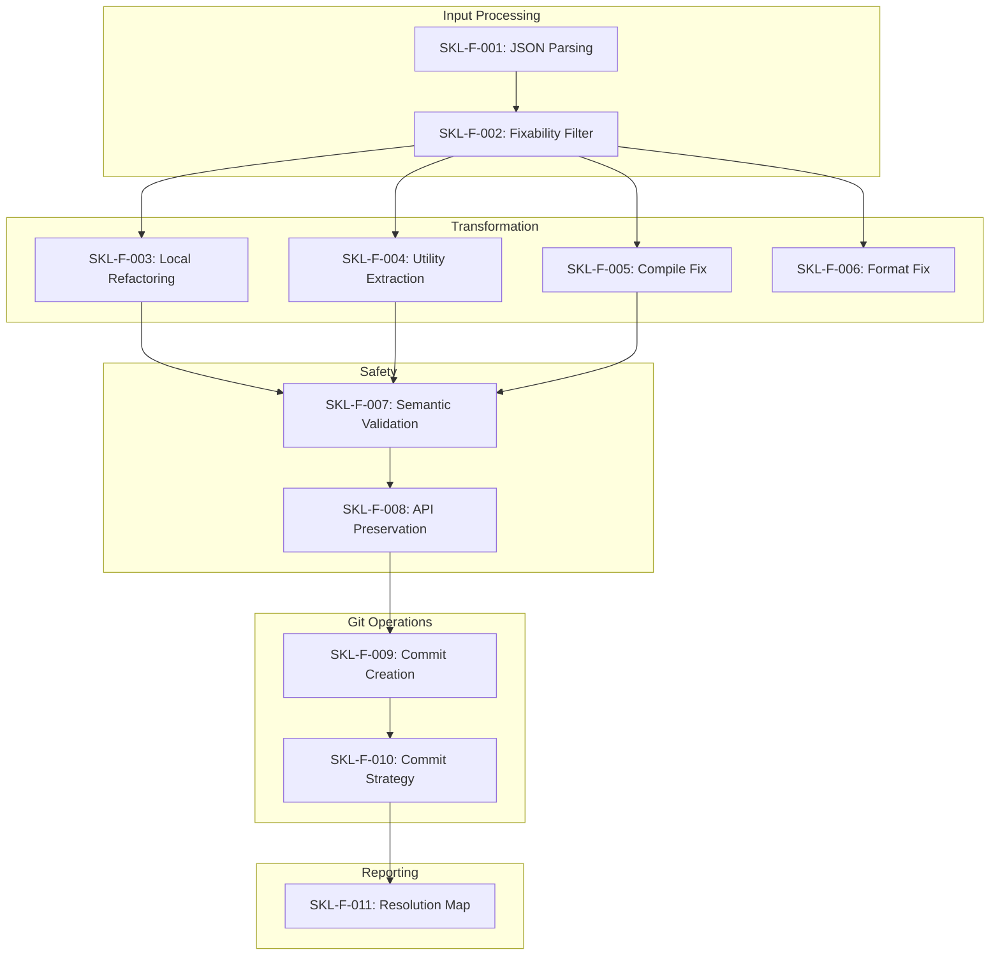

# AI Code Review System - Skills Definition

**Version:** 1.0  
**Based on:** requirements.md v1.0  
**Last Updated:** 2026-01-21

---

## Table of Contents

1. [Overview](#1-overview)
2. [Reviewer Agent Skills](#2-reviewer-agent-skills)
3. [Fixer Agent Skills](#3-fixer-agent-skills)
4. [Verifier Agent Skills](#4-verifier-agent-skills)
5. [Shared Platform Skills](#5-shared-platform-skills)
6. [Skill Dependency Matrix](#6-skill-dependency-matrix)

---

## 1. Overview

This document defines the discrete skills required by each agent in the AI Code Review System. Skills are atomic capabilities that can be implemented, tested, and composed to fulfill the requirements specified in `requirements.md`.

### Skill Naming Convention

```
SKL-<AGENT>-<NUMBER>
```

| Prefix | Agent |
|--------|-------|
| SKL-R | Reviewer Agent |
| SKL-F | Fixer Agent |
| SKL-V | Verifier Agent |
| SKL-P | Shared Platform |

### Skill Priority Levels

| Priority | Definition |
|----------|------------|
| P0 | Critical - System cannot function without this skill |
| P1 | High - Required for core functionality |
| P2 | Medium - Enhances capability but not blocking |
| P3 | Low - Nice to have, can be deferred |

---

## 2. Reviewer Agent Skills

### 2.1 Code Analysis Skills

#### SKL-R-001: Diff Parsing and Context Assembly

| Attribute | Value |
|-----------|-------|
| **Priority** | P0 |
| **Requirement** | REQ-R-001 |
| **Description** | Parse PR diff format (unified diff) and assemble changed file contents with surrounding context |

**Capabilities:**
- Parse unified diff format from any PR platform
- Identify added, removed, and modified lines
- Extract file paths and line number ranges
- Fetch surrounding context (configurable lines before/after)
- Handle binary file detection and exclusion
- Support rename/move detection

**Inputs:**
```json
{
  "diff": "<unified diff string>",
  "context_lines": 10,
  "fetch_full_file": true
}
```

**Outputs:**
```json
{
  "files": [
    {
      "path": "src/service/OrderService.java",
      "change_type": "modified",
      "hunks": [
        {
          "start_line": 120,
          "end_line": 168,
          "content": "<code>",
          "context_before": "<code>",
          "context_after": "<code>"
        }
      ]
    }
  ]
}
```

---

#### SKL-R-002: Complexity Analysis

| Attribute | Value |
|-----------|-------|
| **Priority** | P0 |
| **Requirement** | REQ-R-005 (simplification) |
| **Description** | Analyze code complexity metrics to detect simplification opportunities |

**Capabilities:**
- Calculate cyclomatic complexity per method/function
- Measure nesting depth
- Count method/function length (lines)
- Count parameters
- Detect deeply nested conditionals
- Identify long method chains

**Thresholds (configurable via `.ai/review.yml`):**

| Metric | Default Threshold |
|--------|-------------------|
| Cyclomatic complexity | > 10 |
| Nesting depth | > 3 levels |
| Method length | > 50 lines |
| Parameter count | > 5 |

**Supported Languages:**
- Java
- TypeScript/JavaScript
- Python
- Go
- C#
- Kotlin

---

#### SKL-R-003: Duplication Detection

| Attribute | Value |
|-----------|-------|
| **Priority** | P1 |
| **Requirement** | REQ-R-005 (duplication) |
| **Description** | Detect near-identical code blocks and repeated patterns |

**Capabilities:**
- Token-based similarity analysis
- AST-based structural comparison
- Cross-file duplicate detection
- Pattern recognition for repeated idioms
- Configurable similarity threshold

**Detection Criteria:**

| Criterion | Default |
|-----------|---------|
| Minimum block size | 5 lines |
| Similarity threshold | 80% |
| Minimum occurrences | 2 |

**Outputs:**
```json
{
  "duplicates": [
    {
      "locations": [
        { "file": "UserMapper.java", "start": 44, "end": 63 },
        { "file": "CustomerMapper.java", "start": 51, "end": 70 }
      ],
      "similarity": 0.92,
      "pattern_type": "email_normalization"
    }
  ]
}
```

---

#### SKL-R-004: Behavior Change Detection

| Attribute | Value |
|-----------|-------|
| **Priority** | P0 |
| **Requirement** | REQ-R-005 (breakage) |
| **Description** | Detect changes that may break existing functionality or contracts |

**Capabilities:**
- Exception handling change detection (throws added/removed)
- Null/empty handling change detection
- Default value change detection
- Return type change detection
- Public API signature change detection
- Fallback logic modification detection

**Detection Patterns:**

| Pattern | Description |
|---------|-------------|
| `exception_added` | Method now throws where it didn't |
| `exception_removed` | Method no longer throws |
| `null_handling_changed` | Different behavior for null input |
| `default_changed` | Fallback/default value modified |
| `signature_changed` | Public method signature altered |
| `return_type_changed` | Return type modified |

**Output:**
```json
{
  "breakages": [
    {
      "type": "exception_added",
      "location": { "file": "ConfigResolver.java", "line": 77 },
      "previous": "Returns default config on missing",
      "current": "Throws ConfigNotFoundException",
      "confidence": 0.88
    }
  ]
}
```

---

#### SKL-R-005: Static Analysis Integration

| Attribute | Value |
|-----------|-------|
| **Priority** | P1 |
| **Requirement** | REQ-R-005 (syntax) |
| **Description** | Integrate with static analysis tools and parse their outputs |

**Capabilities:**
- Parse compiler error output (javac, tsc, gcc, etc.)
- Parse linter output (ESLint, Checkstyle, Pylint, etc.)
- Parse type checker output (TypeScript, mypy, etc.)
- Normalize findings to common format
- Map tool-specific severity to system severity

**Supported Tools:**

| Category | Tools |
|----------|-------|
| Compilers | javac, tsc, go build, rustc, gcc |
| Linters | ESLint, Checkstyle, Pylint, golint, clippy |
| Type Checkers | TypeScript, mypy, Flow |
| Formatters | Prettier, Black, gofmt |

---

### 2.2 Finding Generation Skills

#### SKL-R-006: Finding ID Generation

| Attribute | Value |
|-----------|-------|
| **Priority** | P0 |
| **Requirement** | REQ-R-004 |
| **Description** | Generate stable, unique finding IDs that persist across re-runs |

**Capabilities:**
- Generate IDs in format `AI-NNN`
- Maintain ID stability for same issue across re-runs
- Hash-based ID generation from location + type + content
- ID collision detection and resolution

**Algorithm:**
```
ID = "AI-" + hash(file_path + start_line + finding_type + content_hash)[:3]
```

---

#### SKL-R-007: Severity Classification

| Attribute | Value |
|-----------|-------|
| **Priority** | P0 |
| **Requirement** | REQ-R-006 |
| **Description** | Classify findings into severity levels based on impact |

**Classification Rules:**

| Severity | Criteria |
|----------|----------|
| `blocker` | Compile error, runtime failure, critical security issue |
| `major` | High complexity (>15), behavior change, significant duplication |
| `minor` | Style issues, minor complexity, small duplication |

**Factors:**
- Finding type weight
- Confidence score
- Location (public API vs internal)
- Scope of impact

---

#### SKL-R-008: Confidence Scoring

| Attribute | Value |
|-----------|-------|
| **Priority** | P0 |
| **Requirement** | REQ-R-007 |
| **Description** | Assign confidence scores (0.0-1.0) to findings |

**Scoring Factors:**

| Factor | Weight |
|--------|--------|
| Deterministic detection (compile error) | 1.0 |
| Static analysis tool match | 0.9 |
| AST-based pattern match | 0.8 |
| Heuristic detection | 0.6-0.7 |
| Fuzzy/uncertain match | 0.4-0.5 |

---

#### SKL-R-009: Acceptance Criteria Generation

| Attribute | Value |
|-----------|-------|
| **Priority** | P0 |
| **Requirement** | REQ-R-009 |
| **Description** | Generate testable acceptance criteria for each finding |

**Capabilities:**
- Generate behavior preservation criteria
- Generate API contract preservation criteria
- Generate measurable improvement criteria (complexity reduction)
- Generate regression prevention criteria

**Templates by Finding Type:**

| Type | Criteria Templates |
|------|-------------------|
| simplification | "Behavior preserved", "API unchanged", "Complexity reduced to < X" |
| duplication | "Single canonical implementation", "All usages updated" |
| breakage | "Previous behavior restored" OR "Breaking change documented" |
| syntax | "Compiles successfully", "Lint passes" |

---

#### SKL-R-010: Autofix Decision

| Attribute | Value |
|-----------|-------|
| **Priority** | P0 |
| **Requirement** | REQ-R-008 |
| **Description** | Determine if a finding can be safely auto-fixed |

**Decision Matrix:**

| Finding Type | Confidence | Deterministic | Autofix Allowed |
|--------------|------------|---------------|-----------------|
| syntax | >= 0.9 | Yes | true |
| syntax | < 0.9 | No | false |
| simplification | >= 0.7 | - | true (local_refactor) |
| duplication | >= 0.7 | - | true (extract_utility) |
| breakage | any | - | false |

**Risk Assessment:**
- Low risk: import fixes, format fixes
- Medium risk: local refactor, extract utility
- High risk: cross-file changes, API changes

---

### 2.3 Output Generation Skills

#### SKL-R-011: Structured JSON Output

| Attribute | Value |
|-----------|-------|
| **Priority** | P0 |
| **Requirement** | REQ-R-003 |
| **Description** | Generate structured JSON findings conforming to schema |

**Capabilities:**
- Generate valid JSON per schema (Section 4.1 of requirements)
- Include all required fields
- Validate output before posting
- Handle special characters and escaping

---

#### SKL-R-012: Inline Comment Formatting

| Attribute | Value |
|-----------|-------|
| **Priority** | P0 |
| **Requirement** | REQ-R-002 |
| **Description** | Format findings as inline PR comments |

**Template:**
```
[{id}][{severity}][{confidence}] {title}

**Why it matters:** {explanation}

**Recommendation:** {recommendation}

**Patch hint:**
{suggested_patch}

**Acceptance criteria:**
{criteria_list}
```

---

#### SKL-R-013: PR Status Determination

| Attribute | Value |
|-----------|-------|
| **Priority** | P1 |
| **Requirement** | REQ-R-010 |
| **Description** | Determine PR check status based on findings |

**Status Rules:**

| Condition | Status |
|-----------|--------|
| No major or blocker | `success` |
| Major findings, all fixable | `warning` |
| Any blocker OR high-confidence compile error | `failure` |

---

### 2.4 Configuration Skills

#### SKL-R-014: Configuration Parsing

| Attribute | Value |
|-----------|-------|
| **Priority** | P0 |
| **Requirement** | REQ-R-011 |
| **Description** | Parse and apply repository configuration from `.ai/review.yml` |

**Capabilities:**
- Parse YAML configuration
- Merge with system defaults
- Apply path ignore patterns
- Apply language-specific thresholds
- Apply custom rules

---

## 3. Fixer Agent Skills

### 3.1 Input Processing Skills

#### SKL-F-001: Finding JSON Parsing

| Attribute | Value |
|-----------|-------|
| **Priority** | P0 |
| **Requirement** | REQ-F-001 |
| **Description** | Parse structured findings from PR summary comment |

**Capabilities:**
- Extract JSON block from markdown comment
- Validate against finding schema
- Handle malformed JSON gracefully
- Extract inline comment context

---

#### SKL-F-002: Fixability Filtering

| Attribute | Value |
|-----------|-------|
| **Priority** | P0 |
| **Requirement** | REQ-F-003, REQ-F-004 |
| **Description** | Filter findings to only those safe to auto-fix |

**Filter Criteria:**
- `autofix.allowed == true`
- Risk level <= `max_autofix_risk` policy
- Strategy supported by available transformers

---

### 3.2 Code Transformation Skills

#### SKL-F-003: Local Refactoring

| Attribute | Value |
|-----------|-------|
| **Priority** | P0 |
| **Requirement** | REQ-F-005 |
| **Description** | Apply safe refactoring transformations within a single method/function |

**Transformations:**
- Early return extraction
- Guard clause insertion
- Condition inversion and simplification
- Nested if flattening
- Variable extraction
- Magic number extraction

**Safety Constraints:**
- Preserve all code paths
- Maintain exception behavior
- Keep public signature unchanged

---

#### SKL-F-004: Utility Extraction

| Attribute | Value |
|-----------|-------|
| **Priority** | P1 |
| **Requirement** | REQ-F-005 |
| **Description** | Extract duplicated code into shared utility methods |

**Capabilities:**
- Identify extraction point (util package, base class)
- Generate utility method signature
- Replace duplicate occurrences with utility calls
- Handle import additions

**Safety Constraints:**
- Preserve exact behavior
- Maintain visibility rules
- No breaking changes to existing code

---

#### SKL-F-005: Compile Error Fix

| Attribute | Value |
|-----------|-------|
| **Priority** | P0 |
| **Requirement** | REQ-F-005 |
| **Description** | Fix deterministic compilation errors |

**Fix Types:**
- Missing import addition
- Incorrect import correction
- Type parameter fixes
- Missing method implementation stubs
- Syntax error correction (missing semicolons, brackets)

---

#### SKL-F-006: Format Fix

| Attribute | Value |
|-----------|-------|
| **Priority** | P2 |
| **Requirement** | REQ-F-005 |
| **Description** | Apply formatting corrections |

**Capabilities:**
- Apply language-specific formatters
- Fix indentation
- Fix whitespace issues
- Normalize line endings

---

### 3.3 Behavior Preservation Skills

#### SKL-F-007: Semantic Equivalence Validation

| Attribute | Value |
|-----------|-------|
| **Priority** | P0 |
| **Requirement** | REQ-F-005, REQ-F-006 |
| **Description** | Validate that code changes preserve existing behavior |

**Validation Checks:**
- Control flow graph equivalence
- Exception path preservation
- Return value equivalence
- Side effect preservation

---

#### SKL-F-008: API Contract Preservation

| Attribute | Value |
|-----------|-------|
| **Priority** | P0 |
| **Requirement** | REQ-F-006 |
| **Description** | Ensure public API contracts are not broken |

**Checks:**
- Method signature unchanged
- Return type unchanged
- Exception declaration unchanged
- Visibility unchanged

---

### 3.4 Git Operations Skills

#### SKL-F-009: Commit Creation

| Attribute | Value |
|-----------|-------|
| **Priority** | P0 |
| **Requirement** | REQ-F-007 |
| **Description** | Create git commits with proper message format |

**Commit Message Format:**
```
AI Review Fix: <short description> (<finding-ids>)

<detailed description of changes>

Findings addressed:
- <finding-id>: <resolution summary>
```

---

#### SKL-F-010: Commit Strategy Selection

| Attribute | Value |
|-----------|-------|
| **Priority** | P1 |
| **Requirement** | REQ-F-010 |
| **Description** | Select optimal commit strategy (per-finding vs per-category) |

**Strategies:**
- One commit per finding (maximum traceability)
- One commit per category (reduced noise)
- Single commit (atomic change)

**Selection Criteria:**
- Number of findings
- Finding independence
- Repository preference

---

### 3.5 Reporting Skills

#### SKL-F-011: Resolution Map Generation

| Attribute | Value |
|-----------|-------|
| **Priority** | P0 |
| **Requirement** | REQ-F-008, REQ-F-009 |
| **Description** | Generate resolution map comment linking findings to commits |

**Output Format:**
```json
{
  "resolution": [
    {
      "finding_id": "AI-001",
      "status": "resolved|needs_human",
      "commit": "<hash>",
      "notes": "<description>"
    }
  ]
}
```

---

## 4. Verifier Agent Skills

### 4.1 Scoped Analysis Skills

#### SKL-V-001: Fix Commit Range Identification

| Attribute | Value |
|-----------|-------|
| **Priority** | P0 |
| **Requirement** | REQ-V-001 |
| **Description** | Identify and scope review to AI-Fix commit range only |

**Capabilities:**
- Parse resolution map to find commit hashes
- Generate commit range for review
- Fetch only affected diffs

---

#### SKL-V-002: Focused Diff Analysis

| Attribute | Value |
|-----------|-------|
| **Priority** | P0 |
| **Requirement** | REQ-V-001 |
| **Description** | Analyze only diffs introduced by fix commits |

**Capabilities:**
- Filter diff to fix commits only
- Exclude unrelated changes
- Map changes to original findings

---

### 4.2 Validation Skills

#### SKL-V-003: Acceptance Criteria Validation

| Attribute | Value |
|-----------|-------|
| **Priority** | P0 |
| **Requirement** | REQ-V-002 |
| **Description** | Validate each finding's acceptance criteria are met |

**Validation Types:**

| Criterion Type | Validation Method |
|----------------|-------------------|
| Behavior preserved | Semantic analysis |
| API unchanged | Signature comparison |
| Complexity reduced | Re-calculate metrics |
| Compiles successfully | Compiler invocation |
| Lint passes | Linter invocation |

---

#### SKL-V-004: Regression Detection

| Attribute | Value |
|-----------|-------|
| **Priority** | P0 |
| **Requirement** | REQ-V-003 |
| **Description** | Detect new issues introduced by fix commits |

**Detection Scope:**
- New complexity introduced
- New duplication introduced
- New compile/lint errors
- New behavior changes

---

#### SKL-V-005: Static Tool Verification

| Attribute | Value |
|-----------|-------|
| **Priority** | P1 |
| **Requirement** | REQ-V-004 |
| **Description** | Verify static analysis status improved after fixes |

**Checks:**
- Compile errors resolved
- Lint errors reduced
- Type errors fixed

---

### 4.3 Reporting Skills

#### SKL-V-006: Resolution Report Generation

| Attribute | Value |
|-----------|-------|
| **Priority** | P0 |
| **Requirement** | REQ-V-005 |
| **Description** | Generate resolution report with per-finding status |

**Output Structure:**
```markdown
## AI Verify Resolution Report

| Finding | Status | Notes |
|---------|--------|-------|
| AI-001 | Resolved | Criteria met |
| AI-002 | Regression | New issue introduced |

### New Issues
- AI-005: <description>

### Recommendation
<ready for merge / needs fix cycle / needs human>
```

---

#### SKL-V-007: Regression Finding Generation

| Attribute | Value |
|-----------|-------|
| **Priority** | P0 |
| **Requirement** | REQ-V-006 |
| **Description** | Generate new finding IDs for detected regressions |

**Capabilities:**
- Assign new IDs (AI-NNN format, continuing sequence)
- Link regression to original fix
- Include full finding details

---

#### SKL-V-008: Fix Loop Trigger

| Attribute | Value |
|-----------|-------|
| **Priority** | P1 |
| **Requirement** | REQ-V-007 |
| **Description** | Trigger additional fix loop when regressions found |

**Trigger Conditions:**
- New blocker/major findings detected
- Max loop iterations not reached
- Regressions are auto-fixable

---

## 5. Shared Platform Skills

### 5.1 PR Platform Integration

#### SKL-P-001: Platform Abstraction

| Attribute | Value |
|-----------|-------|
| **Priority** | P0 |
| **Requirement** | Section 1.3 (platforms) |
| **Description** | Abstract PR platform operations for GitHub/GitLab/Bitbucket |

**Operations:**
- Fetch PR metadata
- Fetch PR diff
- Post inline comment
- Post summary comment
- Set PR status/check
- Read existing comments

**Platform Adapters:**

| Platform | Adapter |
|----------|---------|
| GitHub | GitHub REST/GraphQL API |
| GitLab | GitLab REST API |
| Bitbucket | Bitbucket REST API |

---

#### SKL-P-002: Comment Parsing

| Attribute | Value |
|-----------|-------|
| **Priority** | P0 |
| **Requirement** | Section 7 (comment formats) |
| **Description** | Parse AI-generated comments from PR |

**Capabilities:**
- Identify AI review summary comment
- Extract JSON block from markdown
- Parse inline comment metadata
- Handle comment edits/updates

---

#### SKL-P-003: Comment Deduplication

| Attribute | Value |
|-----------|-------|
| **Priority** | P1 |
| **Requirement** | REQ-NF-002 (idempotency) |
| **Description** | Prevent duplicate comments on re-runs |

**Capabilities:**
- Check for existing AI comments
- Update existing vs post new
- Clean up stale comments

---

### 5.2 Event Handling

#### SKL-P-004: Trigger Event Handling

| Attribute | Value |
|-----------|-------|
| **Priority** | P0 |
| **Requirement** | Section 5.1 (triggers) |
| **Description** | Handle PR events and manual commands |

**Events:**
- `pr_opened`
- `pr_reopened`
- `pr_updated`
- `pr_ready_for_review`
- `comment_command` (/ai-review, /ai-fix, /ai-verify)

---

#### SKL-P-005: Debounce Management

| Attribute | Value |
|-----------|-------|
| **Priority** | P1 |
| **Requirement** | Section 5.2 (debounce) |
| **Description** | Implement debounce logic to prevent spam |

**Rules:**
- 10-minute minimum between automatic runs
- Manual commands bypass debounce
- Queue subsequent triggers

---

### 5.3 State Management

#### SKL-P-006: Loop State Persistence

| Attribute | Value |
|-----------|-------|
| **Priority** | P1 |
| **Requirement** | REQ-NF-005 (reliability) |
| **Description** | Persist loop state across agent restarts |

**State Elements:**
- Current loop iteration
- Pending findings
- Applied fixes
- Verification status

---

#### SKL-P-007: Audit Logging

| Attribute | Value |
|-----------|-------|
| **Priority** | P1 |
| **Requirement** | REQ-NF-006 (security) |
| **Description** | Log all agent actions for audit trail |

**Log Events:**
- Agent invocation
- Findings generated
- Fixes applied
- Comments posted
- Errors encountered

---

## 6. Skill Dependency Matrix

### 6.1 Reviewer Agent Dependencies



### 6.2 Fixer Agent Dependencies



### 6.3 Cross-Agent Dependencies

| Skill | Depends On |
|-------|------------|
| SKL-F-001 | SKL-R-011 (JSON output) |
| SKL-V-001 | SKL-F-011 (resolution map) |
| SKL-V-003 | SKL-R-009 (acceptance criteria) |
| SKL-V-007 | SKL-R-006 (ID generation) |

---

## Appendix A: Skill Implementation Checklist

| Skill ID | Name | Priority | Status |
|----------|------|----------|--------|
| SKL-R-001 | Diff Parsing | P0 | Pending |
| SKL-R-002 | Complexity Analysis | P0 | Pending |
| SKL-R-003 | Duplication Detection | P1 | Pending |
| SKL-R-004 | Behavior Change Detection | P0 | Pending |
| SKL-R-005 | Static Analysis Integration | P1 | Pending |
| SKL-R-006 | Finding ID Generation | P0 | Pending |
| SKL-R-007 | Severity Classification | P0 | Pending |
| SKL-R-008 | Confidence Scoring | P0 | Pending |
| SKL-R-009 | Acceptance Criteria Generation | P0 | Pending |
| SKL-R-010 | Autofix Decision | P0 | Pending |
| SKL-R-011 | Structured JSON Output | P0 | Pending |
| SKL-R-012 | Inline Comment Formatting | P0 | Pending |
| SKL-R-013 | PR Status Determination | P1 | Pending |
| SKL-R-014 | Configuration Parsing | P0 | Pending |
| SKL-F-001 | Finding JSON Parsing | P0 | Pending |
| SKL-F-002 | Fixability Filtering | P0 | Pending |
| SKL-F-003 | Local Refactoring | P0 | Pending |
| SKL-F-004 | Utility Extraction | P1 | Pending |
| SKL-F-005 | Compile Error Fix | P0 | Pending |
| SKL-F-006 | Format Fix | P2 | Pending |
| SKL-F-007 | Semantic Equivalence Validation | P0 | Pending |
| SKL-F-008 | API Contract Preservation | P0 | Pending |
| SKL-F-009 | Commit Creation | P0 | Pending |
| SKL-F-010 | Commit Strategy Selection | P1 | Pending |
| SKL-F-011 | Resolution Map Generation | P0 | Pending |
| SKL-V-001 | Fix Commit Range Identification | P0 | Pending |
| SKL-V-002 | Focused Diff Analysis | P0 | Pending |
| SKL-V-003 | Acceptance Criteria Validation | P0 | Pending |
| SKL-V-004 | Regression Detection | P0 | Pending |
| SKL-V-005 | Static Tool Verification | P1 | Pending |
| SKL-V-006 | Resolution Report Generation | P0 | Pending |
| SKL-V-007 | Regression Finding Generation | P0 | Pending |
| SKL-V-008 | Fix Loop Trigger | P1 | Pending |
| SKL-P-001 | Platform Abstraction | P0 | Pending |
| SKL-P-002 | Comment Parsing | P0 | Pending |
| SKL-P-003 | Comment Deduplication | P1 | Pending |
| SKL-P-004 | Trigger Event Handling | P0 | Pending |
| SKL-P-005 | Debounce Management | P1 | Pending |
| SKL-P-006 | Loop State Persistence | P1 | Pending |
| SKL-P-007 | Audit Logging | P1 | Pending |

---

## Appendix B: Skill Count Summary

| Agent | P0 | P1 | P2 | Total |
|-------|----|----|----|----|
| Reviewer | 11 | 3 | 0 | 14 |
| Fixer | 8 | 2 | 1 | 11 |
| Verifier | 6 | 2 | 0 | 8 |
| Platform | 4 | 3 | 0 | 7 |
| **Total** | **29** | **10** | **1** | **40** |

---

## Document History

| Version | Date | Author | Changes |
|---------|------|--------|---------|
| 1.0 | 2026-01-21 | AI | Initial draft based on requirements.md |

